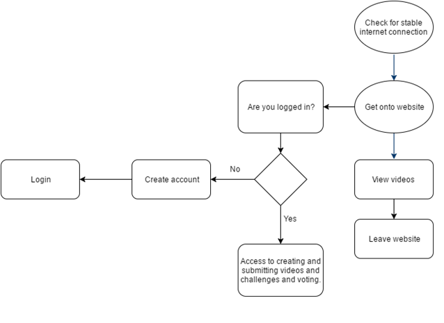
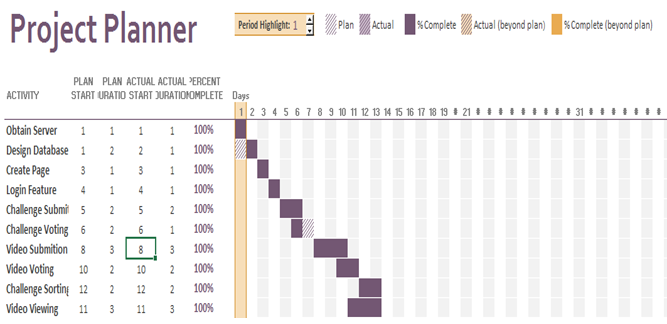

# Project Management Document

ChallengeMe

  Team Members: Benjamin Bordelon, Mahdi      Judeh, Harry Ly, Blake Roussel, Alex Pagan

CSC 4330

Nash

Index:

Vision ….……………………………………………………………………………….….………...…..1

Configuration Management Plan ………. …………………………………………….…..…….….....2

Process Model …………………………………………………………………………..……….….….3

Deliverables…………………………………………...…...……………………….….………..…...….4

Potential Risks …………………………………………………………………….….………………...5

Team Members…………………………………………………………………….……….………...……......6

Project Schedule: Gantt Chart………….………………………………………….….……….…...….7

Meetings Summary……………………………………...………………………………...……….……….……..8

**Vision**

The vision of the ChallengeMe site is to provide users with a platform to view, submit, respond to, and vote on challenges. Challenge Me aims to be a website that provides users with a location to show off their skills and talents to their friends and people around the world. The website will frequently update with user submitted challenges in order to constantly supply users with challenges to watch and participate in.

**Process Model Used**

 
**Configuration Management Plan**

We committed images and documents onto GitHub to make it easier to translate to Markdown. We kept it in folders to make it easier to navigate through and access. We mostly used Google Docs when the team was working together.

**Deliverables**

Software Requirements Specification Document-October 21

Software Design Specification Document-November 2

Software Testing Document-November 21

The &#39;ChallengeMe&#39; website- November 25

**Potential Risks **                          9

The ChallengeMe site holds its fair share of risks. If a user were to post a challenge or a video that is dangerous/inappropriate, the website owners could be held liable. This is why it is necessary for ChallengeMe users to sign a user agreement in order to use the site. In this way, liability can be shifted from ChallengeMe to the user.

 Another risk that pertains to ChallengeMe is the threat of account security breaches. Since sensitive personal information is held in the ChallengeMe database, it is vital that this information be secure, therefore the password information will be encrypted.

 There will also be a report feature on every challenge and video, allowing users to report content that they find offensive or inappropriate. These posts will be forwarded to a moderator who will review them and remove them from the website if the content is indeed found to be inappropriate for the ChallengeMe site.

**Team Members:**

Ben Bordelon - Database design and documentation

Mahdi Judeh – Documentation, testing, programmer, and helped with database

Harry Ly - documentation and testing

Alex Pagan - Documentation and testing. Assisted with the database schema.

Blake Roussel - Database creation and design

**Gantt Chart:**

**ChallengeMe! Ideas**

Web-based application

Voting-based off of the community

Thursday, Sept. 8th, 8 p.m. - Skype Meeting - All Attended

Objective: To discuss topic ideas. To get an idea of what kind of application we wanted.

Summary: We discussed topic ideas. We talked about an application that predicted duck migration as a possible idea. We also talked about creating an application that was based off of a popular app.

Outcome: We decided to brainstorm after the meeting to see if there were any other ideas that people wanted to do. At the next meeting, we would decide on a topic.

Wednesday, Sept. 28th, 10 a.m. - Real Life Meeting - All Attended

Objective: To decide on a topic idea and get started on the project

Summary: This meeting, we finally decided that we would do a website for our project about challenges that people could do. It would be a mix of Youtube and Vine. We also discussed how we would format the website, which would be easy to navigate around. We talked about how we would navigate around the website and where we wanted certain features to be located at. We discussed the core features that we needed for this project and a few features that we could add after we were finished with the core of the website. We talked about the servers that we need for this project, like how we needed at least two for the login information and videos. We assigned different roles and pairs within the group today. We decided that Mahdi and Harry would be working on the view of the website itself. Ben, Blake, and Alex would be working on the database for the login information and videos.

Outcome: We assigned the different roles for the group members. We also had a core understanding of what would be in our website.

(Wednesday, Oct.5) Summary

Objective:  Design the database schema for the ChallengeMe site.

Members: Ben, Alex, Blake

Summary: In order to understand how our website was going to function we needed to decide how our database was going the be structured. We decided that we would need three different tables to go along with the three main entities on our site. The first entity is the user whose attributes are user ID, username, password, email, date of birth, and number of points. Secondly the challenge entity would be made and contains a challenge ID, title, description, point value, a foreign Video ID, and a link. Our final entity we constructed was the video entity and we decided it should have A User ID, challenge ID, link, and a Pass/ Fail value. To make a visual of this schema we first wrote it on a piece of paper to make sure we knew that the primary key were correct and that all of the foreign keys uniquely identified another table. Once we were satisfied with how the logic of our database was represented we were comfortable moving on with the final shema. To construct our final schema we used an online tool to help us.

Outcome: The final product would be a physical representation of how our databased work and will come in handy when the construction of the database itself was underway.

Wednesday, October 12th, 2 p.m. - Real Life Meeting - All Attended

Objective: To continue working on the project and see what was going on with other group members.

Summary: This meeting, we discussed how our servers would be done. When we asked Dr. Nash for advice we concluded that this project would be better off just hosting YouTube links instead of trying to host our own videos on our own database. We also discussed the security issues that our idea may have potentially have by keeping track of the usernames and passwords in our own database. We talked about instead of hosting our own server with username and passwords, we would possibly use Google or Facebook for logging in and accessing the app and just keep track of the username from there. We will meet in our separate groups to start building and researching our website so when we meet next Wednesday we can talk about what other possible issues have arised in our program. We discussed how we might have to start from the back-end due of the website depending on how we decide to host it. We could potentially use WordPress to create our website that way we don&#39;t have to create the backend ourselves. Harry and Mahdi will discuss this and decide before the meeting next Wednesday.

Outcome: We have not done enough individual group research to adequately build the SRS document. In our individual group meetings we will research and start to build prototype frameworks of both the databases and of the front end of the site.

Wednesday, October 19th, 2 p.m. - Real Life Meeting - All Attended

Objective: To continue working on the project and update everyone about the website.

Summary: We divided the SRS document between the group members. We decided on storing links and embedding it into the web page. We decided on making a side click format instead of a playlist format to display more videos. Voting based on if there&#39;s an account or not. Account creation would consist of username and password.

Outcome: We started on the SRS document and solidified some features of the website.

Friday, October 21st, 10 a.m. - Real Life Meeting - All Attended

Objective: To finish the SRS document

Summary: Everyone in the group came together to work on the functional requirements of the SRS document since it was the longest section in our case. Everyone wrote a few of the requirements and once all were complete, as a group, we double checked grammar and made sure there were no inconsistencies. Working on the requirements shed some light on how the website UI will work and how it will look. We met in the library from roughly ten in the morning to seven at night. Our systems are starting to take shape and we are finding out what we can and cannot do.

Outcome: We finished the SRS document
